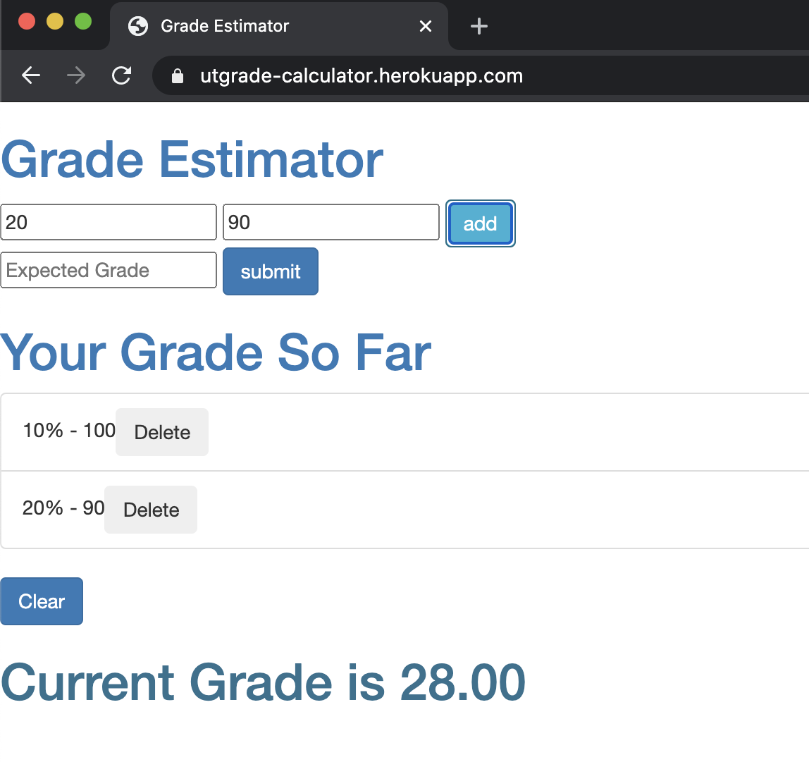

# grade_calculator
https://utgrade-calculator.herokuapp.com/

+ A super simple static web page used to calculate the current score of the course by entering the weight & grade of assignment and tests

+ Also can be used to calcuate the required mark for any particular grade based on the current grade

## Sample Usage
+ By entering weight and grade and click add button the grade entered will be recorded and displayed.  Then the up to date grade based on the mark entered will be displayed

+ By entering expected grade(can be either number like 1-100 or letter grade like A, A- etc) and click submit button the required grade for the grade will be calculated and displayed

+ The clear button is used to erase all the grades that have been entered
